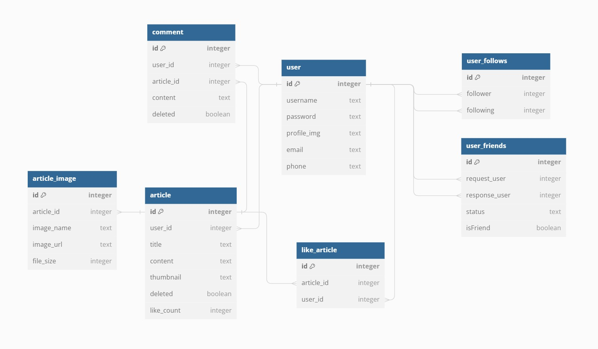

# 📱️멋사SNS📱
> 기존 SNS인 인스타그램이나 페이스북 등과 같이 SNS 플랫폼을 만드는 프로젝트 입니다.

_사용자가 피드를 사진과 함께 자유롭게 올리고, 피드에 댓글을 작성하여 소통하며, 팔로우 및 친구추가를 통해 서로의 피드를 구경할 수 있는 
SNS 플랫폼을 만드는 프로젝트 입니다._

*****

## 📅 개발 기간
- 2023.08.03 ~ 2023.08.08

*****

## 📌 멋사SNS ERD



*****

## ⚙️ 개발 환경
### `JDK : 17.0.7`
### `IDE : IntelliJ IDEA`
### `Framework : Spring 6.0.10 (SpringBoot 3.1.1)`
### `DB : SQLite`
### `Dependency`
> Spring Web
>
> Spring Boot DevTools
>
> Spring Data JPA
>
> Lombok
>
> Validation
>
> Spring Security
>
> jjwt

*****

## 📃 기능 명세
### API 사용 방법
1. git clone
```text
git clone https://github.com/likelion-backend-5th/Project_2_JangYoungjo
```
2. 포스트맨 컬렉션 Import or 아래 포스트맨 웹페이지에 접속하여 API 실행

### [postman_collection](https://documenter.getpostman.com/view/28054688/2s9XxzvtFa)

- ### 📌 회원가입 및 로그인
  > 회원가입 및 로그인의 경우 누구나 사용 가능
  > 아이디 및 비밀번호 필수 입력

  <details>
  <summary>End Point</summary>
  <div>

  ### ➡️ 회원가입 (http://localhost:8080/api/users/register)

  ### `POST /api/users/register`

  Request Body:

  ```json
  {
    "username": "아이디1",
    "password": "1234",
    "passwordCheck": "1234",
    "email": "아이디1@gmail.com",
    "phone": "010-1234-1234"
  }
  ```

  Response Status: 201_CREATED

  Response Body:

  ```json
  {
  "message": "회원가입이 완료되었습니다."
  }
  ```

  ### ➡️ 로그인 (http://localhost:8080/api/users/login)

  ### `POST /api/users/login`

  Request Body:

  ```json
  {
    "username" : "아이디1",
    "password" : "1234"
  }
  ```

  Response Status: 200_OK

  Response Body:

  ```json
  {
  "token": "Bearer eyJhbGciOiJIUzUxMiJ9.eyJzdWIiOiLslYTsnbTrlJQxIiwiaWF0IjoxNjkxMDc
            wOTIwLCJleHAiOjE2OTEwNzQ1MjB9.CHDcwSqcPdbEGP_wF61TQljh1XAuQA0jPfONldiFVVEyD4Ta_
            89YZZ0m6IuPolrgeIISBGE5Ysv5B_nqJWm0-g"
  }
  ```

  ### ➡️ 유저 조회 (http://localhost:8080/api/users/{userId})

  ### `GET /api/users/{userId}`

  Request Headers:

  ```json
  {
    "Authorization" : "Bearer <토큰>"
  }
  ```

  Request Body: 없음

  Response Status: 200_OK

  Response Body:

  ```json
  {
    "token": "Bearer eyJhbGciOiJIUzUxMiJ9.eyJzdWIiOiLslYTsnbTrlJQxIiwiaWF0IjoxNjkxMDc
                wOTIwLCJleHAiOjE2OTEwNzQ1MjB9.CHDcwSqcPdbEGP_wF61TQljh1XAuQA0jPfONldiFVVEyD4Ta_
                89YZZ0m6IuPolrgeIISBGE5Ysv5B_nqJWm0-g"
  }
  ```

  ### ➡️ 유저 정보 수정 (http://localhost:8080/api/users/{userId})

  ### `PUT /api/users/{userId}`

  Request Headers:

  ```json
  {
    "Authorization" : "Bearer <토큰>"
  }
  ```

  Request Body:

  ```json
  {
    "password": "1234",
    "passwordCheck": "1234",
    "email": "아이디1@navar.com",
    "phone": "010-5678-5678"
  }
  ```

  Response Status: 200_OK

  Response Body:

  ```json
  {
    "message": "정보가 변경되었습니다."
  }
  ```

  ### ➡️ 유저 프로필 이미지 등록 (http://localhost:8080/api/users/{userId}/profile)

  ### `PUT /api/users/{userId}`

  Request Headers:

  ```json
  {
    "Authorization" : "Bearer <토큰>"
  }
  ```

  Request Body (Form Data):

  ```
  image:    image.jpg
  ```

  Response Status: 200_OK

  Response Body:

  ```json
  {
    "message": "등록 완료"
  }
  ```

  </div>
  </details>

- ### 📌 피드
  > 사용자의 피드 목록 조회는 누구나 가능합니다.
  >
  > 그 외의 기능은 인증된 사용자만 이용 가능합니다.

  <details>
  <summary>End Point</summary>
  <div>

  ### ➡️ 피드 등록 (http://localhost:8080/api/articles)

  ### `POST /api/articles`

  Request Headers:

  ```json
  {
    "Authorization" : "Bearer <토큰>"
  }
  ```

  Request Body (Form Data):

  ```
  dto:              {"title":"테스트2","content":"내용2"}
  requestImages:    image1.jpg, image2.jpg, image3.jpg, ...
  ```

  Response Status: 201_CREATED

  Response Body:
  ```json
  {
      "message": "피드가 등록되었습니다."
  }
  ```

  ### ➡️ 사용자의 피드 목록 조회 (http://localhost:8080/api/articles?username={username})

  ### `GET /api/articles?username={username}`

  Request Headers:

  ```json
  {
    "Authorization" : "Bearer <토큰>"
  }
  ```

  Request Body: 없음

  Response Status: 200_OK

  Response Body:

  ```json
  [
    {
        "id": 2,
        "username": "아이디1",
        "title": "제목1",
        "thumbnail": "feed\\아이디1\\2023.08.07\\2\\54b2a986-600d-4b01-af32-9d496c7e42e2.jpg",
        "content": "내용1",
        "likeCount": 1
    },
    {
        "id": 3,
        "username": "아이디1",
        "title": "제목1",
        "thumbnail": "feed\\아이디1\\2023.08.07\\3\\e4c7880e-0e26-4a2b-926c-e7cb08237a94.jpg",
        "content": "내용2",
        "likeCount": 0
    },
    {
        "id": 4,
        "username": "아이디1",
        "title": "제목1",
        "thumbnail": "feed\\아이디1\\2023.08.07\\4\\4d97493b-79c4-480b-98cc-7cf94c30cb66.jpg",
        "content": "내용2",
        "likeCount": 0
    }
      ...
  ]
  ```

  ### ➡️ 사용자 피드 단일 조회 (http://localhost:8080/api/articles/{articleId})

  ### `GET /api/articles/{articleId}`

  Request Headers:

  ```json
  {
    "Authorization" : "Bearer <토큰>"
  }
  ```

  Request Body: 없음

  Response Status: 200_OK

  Response Body:

  ```json
  {
    "id": 2,
    "username": "아이디1",
    "title": "제목1",
    "images": [
        {
            "id": 30,
            "imageName": "3.jpg",
            "imageUrl": "feed\\아이디1\\2023.08.07\\2\\0bddaa01-7fba-42a8-a884-f9adf83fb311.jpg"
        },
        {
            "id": 31,
            "imageName": "4.jpg",
            "imageUrl": "feed\\아이디1\\2023.08.07\\2\\bea6cb27-a87b-42c4-97c3-109228b63348.jpg"
        }
    ],
    "content": "내용1",
    "comments": [
        {
            "id": 3,
            "username": "아이디1",
            "content": "댓글 작성2 : 아이디2"
        },
        {
            "id": 4,
            "username": "아이디1",
            "content": "댓글 작성3 : 아이디2"
        },
        {
            "id": 5,
            "username": "아이디1",
            "content": "댓글 작성4 : 아이디2"
        },
        {
            "id": 6,
            "username": "아이디1",
            "content": "댓글 작성5 : 아이디2"
        }
    ],
    "likeCount": 1
  }
  ```

  ### ➡️ 피드 수정 (http://localhost:8080/api/articles/{articleId})

  ### `PUT /api/articles/{articleId}`

  Request Headers:

  ```json
  {
    "Authorization" : "Bearer <토큰>"
  }
  ```

  Request Body (Form Data):

  ```
  dto:              {"title":"테스트1","content":"내용5"}
  requestImages:    image1.jpg, image2.jpg, image3.jpg, ...
  ```

  Response Status: 200_OK

  Response Body:
  ```json
  {
      "message": "피드 수정이 완료되었습니다."
  }
  ```

  ### ➡️ 피드 삭제 (http://localhost:8080/api/users/9/articles/{articleId})

  ###  `DELETE /api/articles/{articleId}`

  Request Headers:

  ```json
  {
    "Authorization" : "Bearer <토큰>"
  }
  ```

  Request Body: 없음

  Response Status: 204_NO_CONTENT

  Response Body: 없음

  ### ➡️ 팔로워 피드 목록 조회 (http://localhost:8080/api/articles/followers?username={username})

  ### `GET /api/articles/followers?username={username}`

  Request Headers:

  ```json
  {
    "Authorization" : "Bearer <토큰>"
  }
  ```

  Request Body: 없음

  Response Status: 200_OK

  Response Body:

  ```json
  [
    {
        "id": 16,
        "username": "아이디2",
        "title": "아이디2의 게시",
        "thumbnail": "src/main/resources/static/default_img.jpg",
        "content": "안녕하세요",
        "likeCount": 0
    },
    {
        "id": 17,
        "username": "아이디2",
        "title": "아이디2의 게시",
        "thumbnail": "src/main/resources/static/default_img.jpg",
        "content": "안녕하세요",
        "likeCount": 0
    },
    {
        "id": 18,
        "username": "아이디2",
        "title": "아이디2의 게시",
        "thumbnail": "src/main/resources/static/default_img.jpg",
        "content": "안녕하세요",
        "likeCount": 0
    },
    {
        "id": 19,
        "username": "아이디2",
        "title": "아이디2의 게시글",
        "thumbnail": "src/main/resources/static/default_img.jpg",
        "content": "안녕하세요",
        "likeCount": 0
    }
  ]
  ```

  ### ➡️ 친구 피드 목록 조회 (http://localhost:8080/api/articles/friends)

  ### `GET /api/articles/friends`

  Request Headers:

  ```json
  {
    "Authorization" : "Bearer <토큰>"
  }
  ```

  Request Body: 없음

  Response Status: 200_OK

  Response Body:

  ```json
  [
    {
        "id": 19,
        "username": "아이디2",
        "title": "아이디2의 게시글",
        "thumbnail": "src/main/resources/static/default_img.jpg",
        "content": "안녕하세요",
        "likeCount": 0
    },
    {
        "id": 18,
        "username": "아이디2",
        "title": "아이디2의 게시",
        "thumbnail": "src/main/resources/static/default_img.jpg",
        "content": "안녕하세요",
        "likeCount": 0
    },
    {
        "id": 11,
        "username": "아이디1",
        "title": "테스트1",
        "thumbnail": "src/main/resources/static/default_img.jpg",
        "content": "내용1",
        "likeCount": 0
    },
    {
        "id": 10,
        "username": "아이디1",
        "title": "하이",
        "thumbnail": "feed\\아이디1\\2023.08.07\\10\\b82e92bd-c1c6-49df-82bd-383ea0b46445.jpg",
        "content": "헬로4",
        "likeCount": 0
    }
    ...
  ]
  ```

  </div>
  </details>

- ### 📌 댓글
  > 댓글 조회는 사용자 피드 단일 조회와 함께 이루어집니다.
  >
  > 그 외의 기능은 인증된 사용자만 이용 가능합니다.

  <details>
  <summary>End Point</summary>
  <div>

  ### ➡️ 댓글 등록 (http://localhost:8080/api/articles/{articleId}/comments)

  ### `POST /api/articles/{articleId}/comments`

  Request Headers:

  ```json
  {
    "Authorization" : "Bearer <토큰>"
  }
  ```

  Request Body:

  ```json
  {
      "content": "댓글 작성5 : 아이디2"
  }
  ```

  Response Status: 201_CREATED

  Response Body:

  ```json
  {
      "message": "댓글이 등록되었습니다."
  }
  ```

  ### ➡️ 댓글 조회 (http://localhost:8080/api/articles/{articleId}/comments)

  ### `GET /api/articles/{articleId}/comments`

  Request Headers:

  ```json
  {
    "Authorization" : "Bearer <토큰>"
  }
  ```

  Request Body: 없음

  Response Status: 200_OK

  Response Body:
  ```json
  [
    {
        "id": 1,
        "articleId": 1,
        "username": "아이디2",
        "content": "댓글 작성5 : 아이디2"
    }
  ]
  ```

  ### ➡️ 댓글 수정 (http://localhost:8080/api/articles/{articleId}/comments/{commentId})

  ### `PUT /api/articles/{articleId}/comments/{commentId}`

  Request Headers:

  ```json
  {
    "Authorization" : "Bearer <토큰>"
  }
  ```

  Request Body:

    ```json
    {
        "content": "댓글 수정2 : 아이디1"
    }
    ```

  Response Status: 200_OK

  Response Body:

    ```json
    {
        "message": "댓글이 수정되었습니다."
    }
    ```

  ### ➡️ 댓글 삭제 (http://localhost:8080/api/articles/{articleId}/comments/{commentId})

  ### `DELETE /api/articles/{articleId}/comments/{commentId}`

  Request Headers:

  ```json
  {
    "Authorization" : "Bearer <토큰>"
  }
  ```

  Request Body: 없음

  Response Status: 204_NO_CONTENT

  Response Body:
  ```json
  {
      "message": "댓글을 삭제했습니다."
  }
  ```

  </div>
  </details>

- ### 📌 피드 좋아요 기능
  > 본인을 제외한 나머지 사용자의 피드에 좋아요를 추가할 수 있습니다.

  <details>
  <summary>End Point</summary>
  <div>

  ### ➡️ 좋아요 추가 및 삭제 (http://localhost:8080/api/articles/{articleId}/like)

  ### `POST /api/articles/{articleId}/like`
  
  Request Headers:

  ```json
  {
    "Authorization" : "Bearer <토큰>"
  }
  ```

  Response Status: 200_OK

  Response Body:

  ```json
  {
    "username": "아이디2",
    "articleId": 2,
    "variation": 1 or -1
  }
  ```

  </div>
  </details>

- ### 📌 사용자 팔로우
  > 본인을 제외한 나머지 사용자에게 팔로우 할 수 있습니다.

  <details>
  <summary>End Point</summary>
  <div>

  ### ➡️ 팔로우 추가 및 삭제 (http://localhost:8080/api/users/{userId}/follow)

  ### `POST /api/users/{userId}/follow`
  
  Request Headers:

  ```json
  {
    "Authorization" : "Bearer <토큰>"
  }
  ```

  Request Body: 없음

  Response Status: 200_OK

  Response Body:

  ```json
  {
    "targetUsername": "아이디2",
    "myUsername": "아이디1",
    "followVariation": 1 or -1,
    "followingVariation": 1 or -1
  }
  ```

  </div>
  </details>

- ### 📌 친구 추가
  > 본인 및 이미 친구인 사용자를 제외한 나머지 사용자에게 친구 추가를 할 수 있습니다.

  <details>
  <summary>End Point</summary>
  <div>

  ### ➡️ 친구 신청 (http://localhost:8080/api/users/{userId}/friends)

  ### `POST /api/users/{userId}/friends`
  
  Request Headers:

  ```json
  {
    "Authorization" : "Bearer <토큰>"
  }
  ```

  Request Body: 없음

  Response Status: 201_CREATED

  Response Body:

  ```json
  {
    "message": "친구 신청이 완료되었습니다."
  }
  ```

  ### ➡️ 친구 신청 목록 조회 (http://localhost:8080/api/users/{userId}/friends)

  ### `GET /api/users/{userId}/friends`
  
  Request Headers:

  ```json
  {
    "Authorization" : "Bearer <토큰>"
  }
  ```

  Request Body: 없음

  Response Status: 200_OK

  Response Body:

  ```json
  [
    {
        "requestUsername": "아이디1",
        "status": "PENDING"
    },
    {
        "requestUsername": "아이디4",
        "status": "PENDING"
    },
    {
        "requestUsername": "아이디2",
        "status": "PENDING"
    }
  ]
  ```

  ### ➡️ 친구 신청 상태 변경 (http://localhost:8080/api/users/{userId}/friends/{friendId})

  ### `GET /api/users/{userId}/friends/{friendId}`
  
  Request Headers:

  ```json
  {
    "Authorization" : "Bearer <토큰>"
  }
  ```

  Request Body:

  ```json
  {
    "status": "ACCEPT"
  }
  ```

  Response Status: 200_OK

  Response Body:

  ```json
  {
    "message": "상태가 변경되었습니다."
  }
  ```

  </div>
  </details>

*****

## 📃 개발 내역
### 📆 2023.08.03
#### 1️⃣ 프로젝트 생성 및 사용자 인증 구현
- 프로젝트 생성 및 환경설정
- 회원가입 및 로그인 기능 구현
- 인증 필터 및 예외 응답 추가

### 📆 2023.08.04
#### 2️⃣ 피드 구현
- 피드 CRUD 구현
- 이미지의 첨부 경우에 따라 이미지 삭제 및 추가 가능
- Soft Delete 적용

### 📆 2023.08.07
#### 3️⃣ 댓글, 좋아요 구현
- 댓글 CRUD 구현
- Soft Delete 적용
- 좋아요 기능 구현 (자신 제외)
- 이미 좋아요 누른 사용자에게 다시 요청 시 좋아요 취소

### 📆 2023.08.08
#### 4️⃣ 사용자 정보 구현 (팔로우, 친구 추가)
- 팔로우 기능 구현
  - 팔로우 시 팔로우 카운트 및 팔로잉 카운트 표시
- 친구 기능 구현
  - 친구 신청 요청에 따른 친구 요청 수락 및 거절 기능 구현
*****